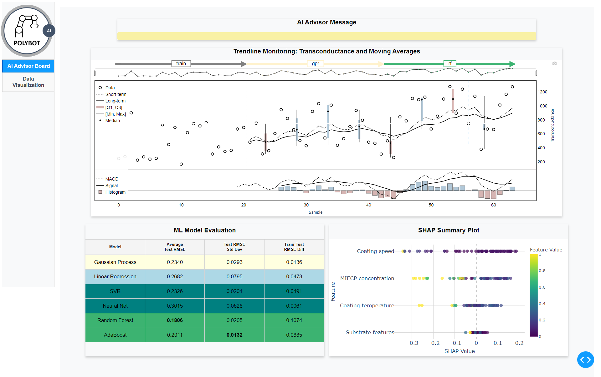

## Installation

To set up the environment and install the necessary dependencies, follow these steps:

1. **Clone the Repository and create the environment**:
```bash
git clone https://github.com/polybot-nexus/robo_advisor_dashboard.git
cd robo_advisor_dashboard
conda create --name robo_advisor_dashboard python=3.10.14
conda activate robo_advisor_dashboard
pip install -r requirements.txt

```

2. **Run the dash app**:

```bash
python robo_advisor.py 

```

3. **Dashboard**:
A screenshot of the dashboard is shown below:



An online version of the dashboard is available in : https://robo-advisor-dashboard.onrender.com  